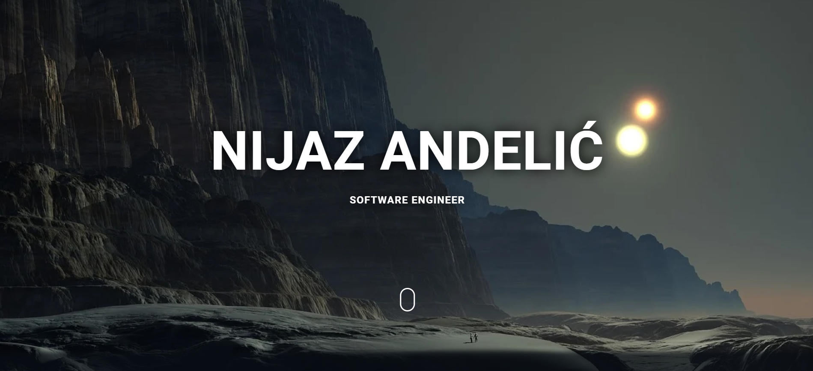
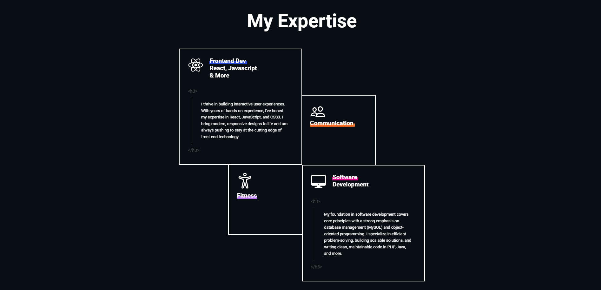
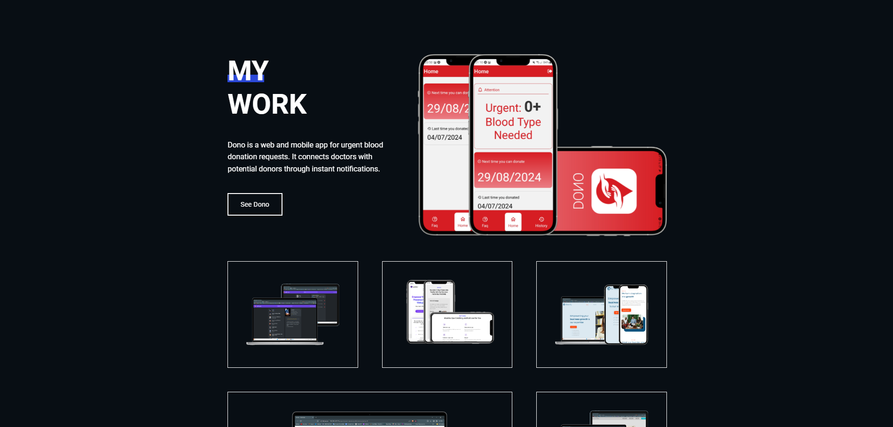

# Nijaz's Portfolio Website

Here you can see the website: (https://nijazz.netlify.app/)


## Project Description
This is the personal portfolio website of Nijaz Andelić, showcasing projects, skills, and professional experience. Designed with a modern and clean layout, the website aims to highlight Nijaz's work and serve as a contact point for potential collaborators or employers.

---

## Features
- **Project Showcase**: Highlights key projects with descriptions and links.
- **Skills Section**: Displays technical skills and proficiencies.
- **Contact Form**: Enables visitors to get in touch directly.
- **Responsive Design**: Ensures seamless browsing across devices.
- **Dynamic Animations**: Adds a modern touch with subtle animations.

---

## Technologies Used
- **HTML5**: For structuring content.
- **CSS3**: For styling and layout.
- **JavaScript**: For interactivity and dynamic elements.
- **React**: Framework for creating a responsive and interactive UI.
- **Netlify**: For hosting and deployment.

---

## Setup Instructions
To run this project locally, follow these steps:

1. Clone the repository:

   ```bash
   git clone https://github.com/AndNijaz/portfolio.git
   ```

2. Navigate to the project directory:

   ```bash
   cd portfolio
   ```

3. Install dependencies:

   ```bash
   npm install
   ```

4. Start the development server:

   ```bash
   npm start
   ```

5. Open `http://localhost:3000` in your browser to view the project.

---

## Usage
The portfolio is designed for:
- **Employers and Recruiters**: Reviewing Nijaz's skills and projects.
- **Potential Collaborators**: Learning about Nijaz's expertise and interests.
- **Visitors**: Connecting with Nijaz via the contact form.

---

## Screenshots

### Homepage


### Features


### Project Showcase


> *Screenshots are stored in the `/img` directory.*

---

## Project Status
This project is **live and operational**. Future updates may include:
- Adding more detailed project descriptions.
- Expanding the skills section with proficiency levels.
- Incorporating a blog section to share insights and experiences.

---

## Acknowledgements
This portfolio is a reflection of Nijaz's professional journey and technical expertise. Special thanks to all collaborators and mentors who have contributed to the showcased projects.

---

